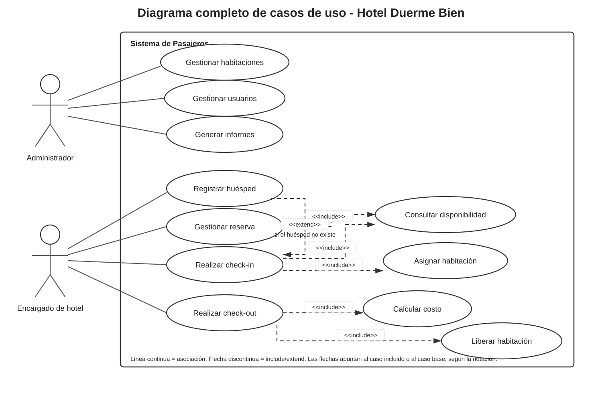
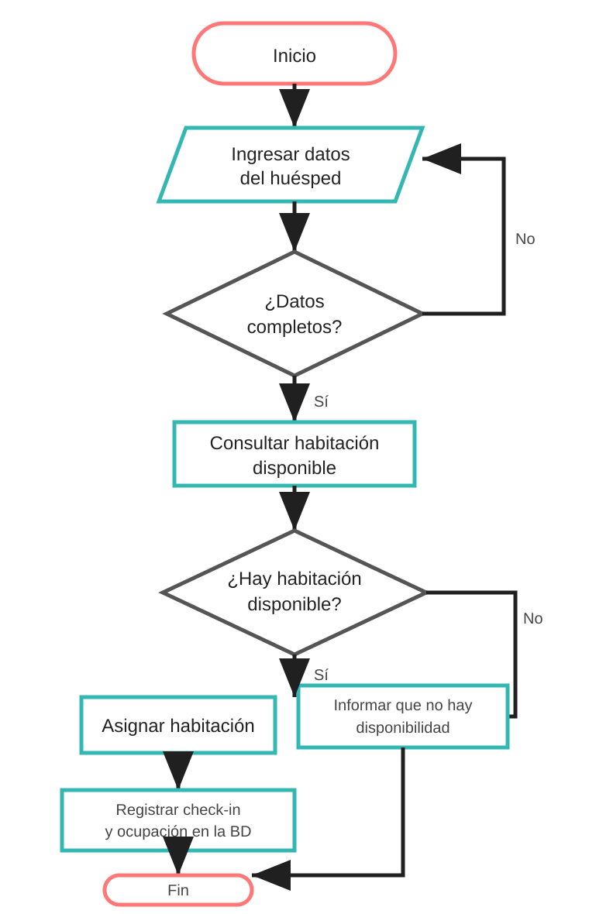
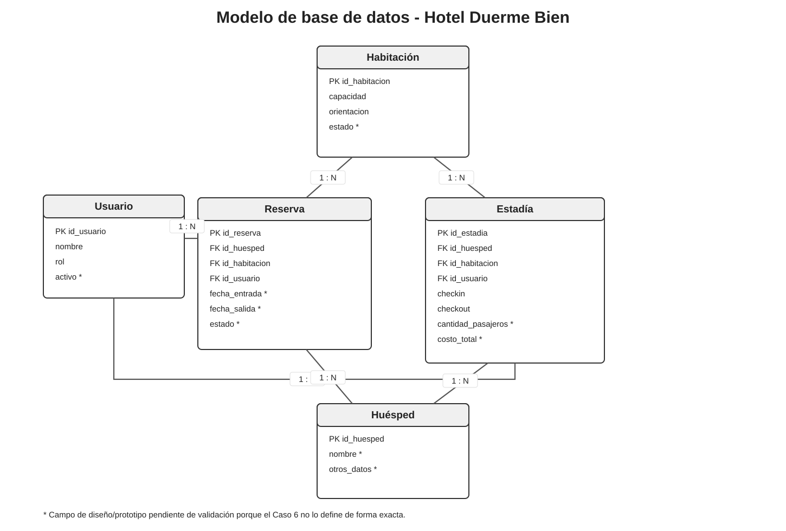
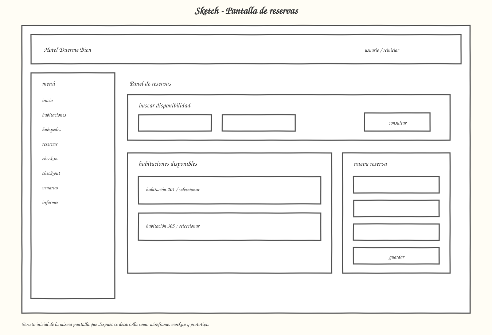
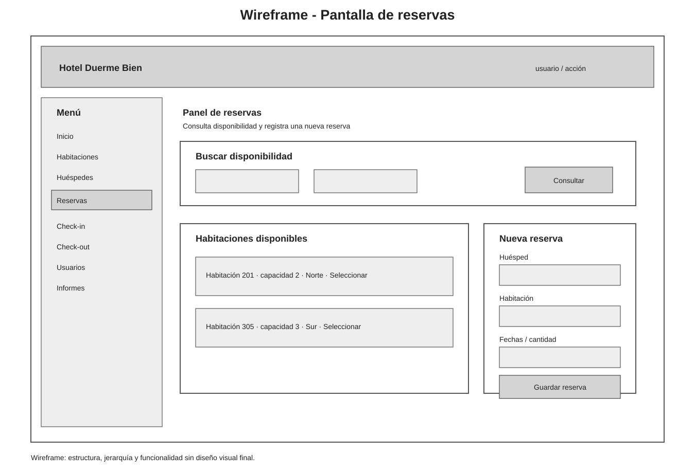
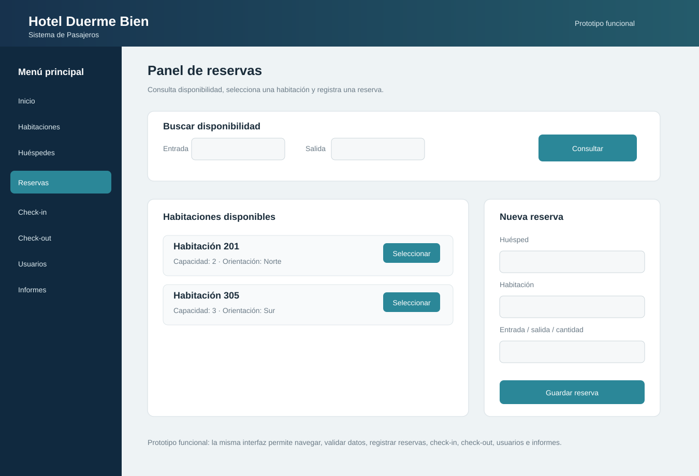

# Sistema de Pasajeros - Hotel Duerme Bien

Entrega final basada en el **Caso 6** y en los entregables indicados por el profesor. Se dejó una sola versión de cada elemento para evitar archivos repetidos.

## 1. Informe de toma de requerimientos

[Ver informe IEEE 830 adaptado](entrega-final/01-requerimientos.md) · [Editar](https://github.com/Yutre3/diego/edit/main/entrega-final/01-requerimientos.md)

## 2. Diagrama de casos de uso

[Ver imagen](entrega-final/02-casos-de-uso.svg) · [Editar en Draw.io](https://app.diagrams.net/?mode=github#HYutre3%2Fdiego%2Fmain%2Fdiagramas-editables%2F01-casos-de-uso.drawio)

## 3. Diagrama de flujo

[Ver imagen](entrega-final/03-diagrama-flujo.svg) · [Editar en Draw.io](https://app.diagrams.net/?mode=github#HYutre3%2Fdiego%2Fmain%2Fdiagramas-editables%2F03-diagrama-proceso-checkin.drawio)

## 4. Modelo de base de datos

[Ver imagen](entrega-final/04-modelo-base-datos.svg) · [Editar en Draw.io](https://app.diagrams.net/?mode=github#HYutre3%2Fdiego%2Fmain%2Fdiagramas-editables%2F09-modelo-base-datos.drawio)

## 5. Prototipo de interfaz

### 5.1 Sketch

[Ver imagen](entrega-final/05-sketch.svg) · [Editar en Draw.io](https://app.diagrams.net/?mode=github#HYutre3%2Fdiego%2Fmain%2Fdiagramas-editables%2F10-interfaz-sketch-wireframe-mockup.drawio)

### 5.2 Wireframe

[Ver imagen](entrega-final/06-wireframe.svg) · [Editar en Draw.io](https://app.diagrams.net/?mode=github#HYutre3%2Fdiego%2Fmain%2Fdiagramas-editables%2F10-interfaz-sketch-wireframe-mockup.drawio)

### 5.3 Mockup

[Ver imagen](entrega-final/07-mockup.svg) · [Editar en Draw.io](https://app.diagrams.net/?mode=github#HYutre3%2Fdiego%2Fmain%2Fdiagramas-editables%2F10-interfaz-sketch-wireframe-mockup.drawio)

### 5.4 Prototipo funcional

[Probar prototipo funcional](https://yutre3.github.io/diego/prototipo-web/prototipo-funcional.html)

Código editable: [HTML](prototipo-web/prototipo-funcional.html) · [CSS](prototipo-web/prototipo-final.css) · [JavaScript](prototipo-web/prototipo-final.js)

El prototipo permite registrar habitaciones, huéspedes y usuarios; consultar disponibilidad; crear y cancelar reservas; realizar check-in y check-out; calcular un costo demostrativo por pasajero; liberar habitaciones y consultar informes de ocupación y reservas.

## 6. Kanban

[Ver planificación Kanban](entrega-final/09-kanban.md) · [Editar](https://github.com/Yutre3/diego/edit/main/entrega-final/09-kanban.md)

---

La retroalimentación real de la Evaluación 1 no estaba incluida en los archivos entregados, por lo que no se inventaron correcciones del docente.
