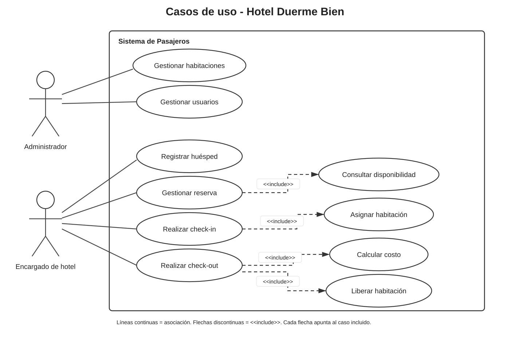
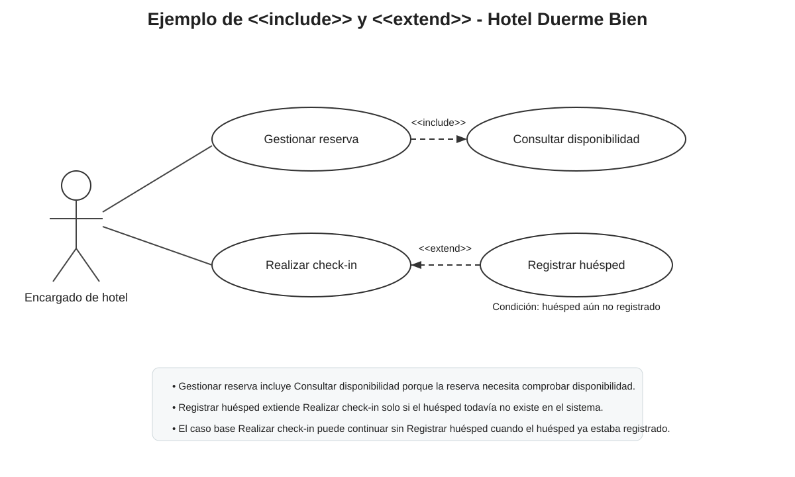
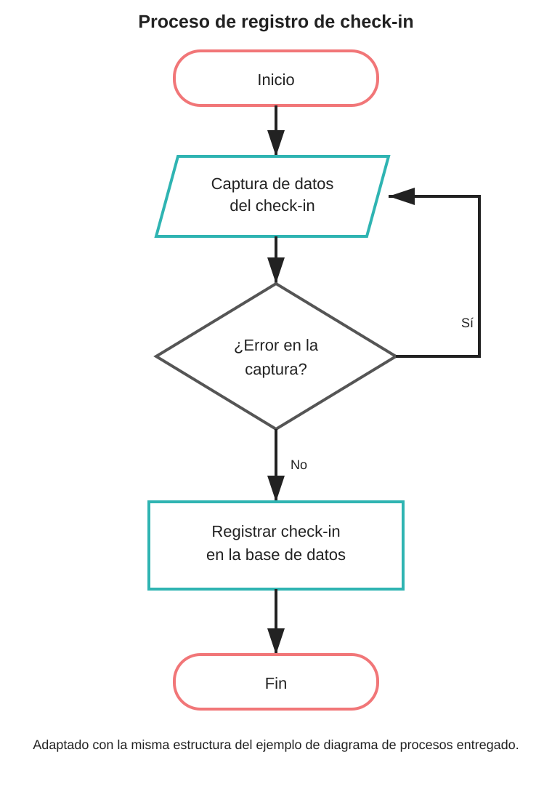
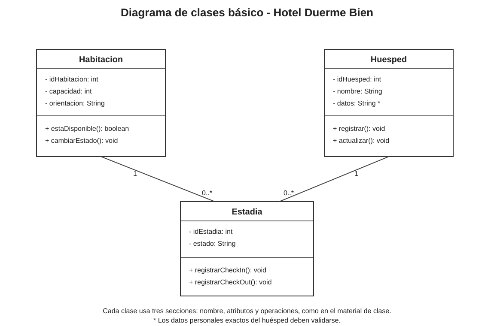
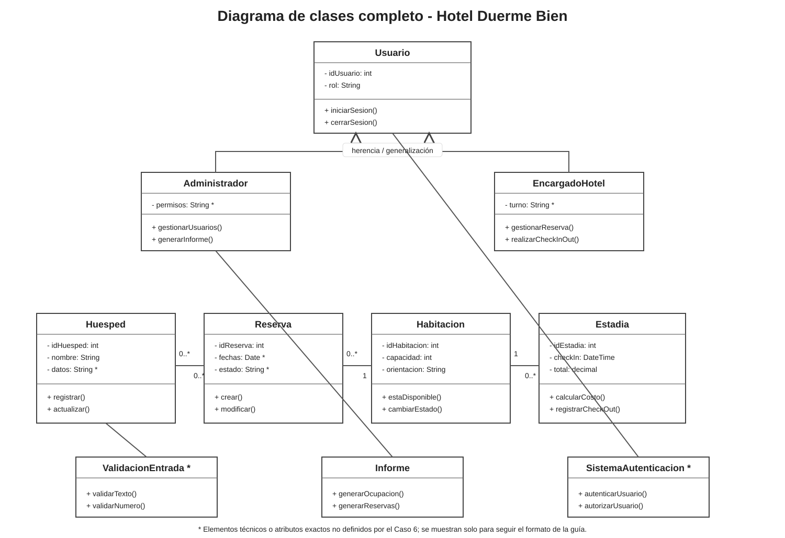
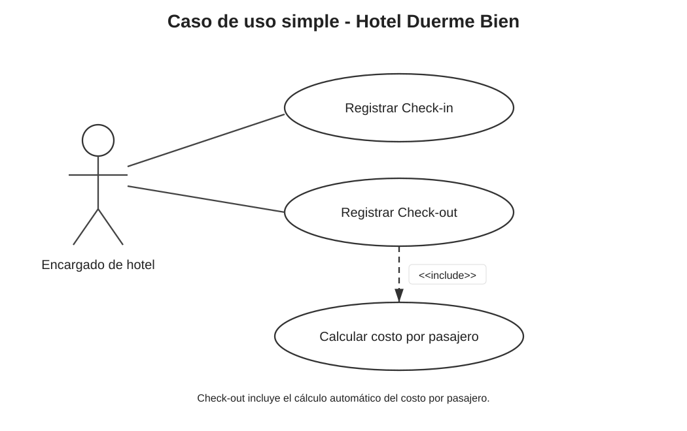
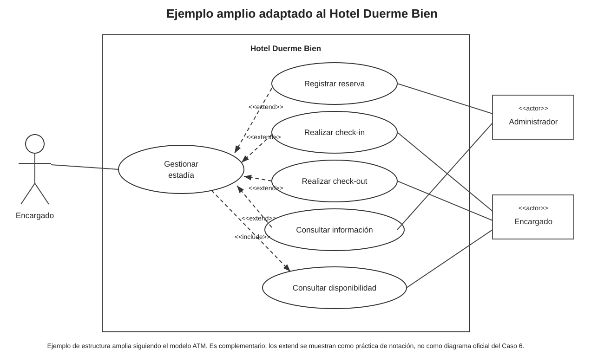

# Sistema de Pasajeros - Hotel Duerme Bien

## ACCESO RÁPIDO

No es necesario entrar carpeta por carpeta. Desde estos enlaces se llega directamente:

| Contenido | Abrir directamente |
| --- | --- |
| Página principal con todos los accesos e imágenes | **https://yutre3.github.io/diego/** |
| Evaluación 1 completa | https://yutre3.github.io/diego/prototipo-web/evaluacion1.html |
| Evaluación 2 completa | https://yutre3.github.io/diego/prototipo-web/evaluacion2.html |
| Prototipo funcional | https://yutre3.github.io/diego/prototipo-web/login.html |
| Material del profesor | https://yutre3.github.io/diego/prototipo-web/ayuda.html |
| Repositorio completo | https://github.com/Yutre3/diego |
| Páginas e imágenes editables | [docs/20_paginas_editables.md](docs/20_paginas_editables.md) |
| Checklist exacto del profesor | [docs/19_checklist_profesor.md](docs/19_checklist_profesor.md) |
| Uno de cada ejemplo adaptado | [ejemplos-profesor-adaptados/README.md](ejemplos-profesor-adaptados/README.md) |

La página principal muestra las imágenes directamente y debajo de cada una tiene botones **Ver grande** y **Editar**.

---

# Páginas del sistema

| Página | Abrir en la web | Editar archivo |
| --- | --- | --- |
| Evaluación 1 | https://yutre3.github.io/diego/prototipo-web/evaluacion1.html | https://github.com/Yutre3/diego/edit/main/prototipo-web/evaluacion1.html |
| Evaluación 2 | https://yutre3.github.io/diego/prototipo-web/evaluacion2.html | https://github.com/Yutre3/diego/edit/main/prototipo-web/evaluacion2.html |
| Acceso | https://yutre3.github.io/diego/prototipo-web/login.html | https://github.com/Yutre3/diego/edit/main/prototipo-web/login.html |
| Inicio | https://yutre3.github.io/diego/prototipo-web/index.html | https://github.com/Yutre3/diego/edit/main/prototipo-web/index.html |
| Habitaciones | https://yutre3.github.io/diego/prototipo-web/habitaciones.html | https://github.com/Yutre3/diego/edit/main/prototipo-web/habitaciones.html |
| Huéspedes | https://yutre3.github.io/diego/prototipo-web/huespedes.html | https://github.com/Yutre3/diego/edit/main/prototipo-web/huespedes.html |
| Reservas | https://yutre3.github.io/diego/prototipo-web/reservas.html | https://github.com/Yutre3/diego/edit/main/prototipo-web/reservas.html |
| Check-in | https://yutre3.github.io/diego/prototipo-web/checkin.html | https://github.com/Yutre3/diego/edit/main/prototipo-web/checkin.html |
| Check-out | https://yutre3.github.io/diego/prototipo-web/checkout.html | https://github.com/Yutre3/diego/edit/main/prototipo-web/checkout.html |
| Usuarios | https://yutre3.github.io/diego/prototipo-web/usuarios.html | https://github.com/Yutre3/diego/edit/main/prototipo-web/usuarios.html |
| Informes | https://yutre3.github.io/diego/prototipo-web/informes.html | https://github.com/Yutre3/diego/edit/main/prototipo-web/informes.html |

Credenciales para probar el prototipo:

- Administrador: `admin / admin123`
- Encargado: `encargado / hotel123`

---

# Imágenes corregidas y visibles

## 1. Casos de uso - cómo iniciar

[Ver grande](ejemplos-profesor-adaptados/01-casos-de-uso-como-iniciar.svg) · [Editar](https://github.com/Yutre3/diego/edit/main/ejemplos-profesor-adaptados/01-casos-de-uso-como-iniciar.svg)

## 2. Include / Extend

[Ver grande](ejemplos-profesor-adaptados/02-include-extend.svg) · [Editar](https://github.com/Yutre3/diego/edit/main/ejemplos-profesor-adaptados/02-include-extend.svg)

## 3. Diagrama de procesos

[Ver grande](ejemplos-profesor-adaptados/04-diagrama-de-procesos.svg) · [Editar](https://github.com/Yutre3/diego/edit/main/ejemplos-profesor-adaptados/04-diagrama-de-procesos.svg)

## 4. Diagrama de clase básico

[Ver grande](ejemplos-profesor-adaptados/05-diagrama-clase-basico.svg) · [Editar](https://github.com/Yutre3/diego/edit/main/ejemplos-profesor-adaptados/05-diagrama-clase-basico.svg)

## 5. Guía de clases completa

[Ver grande](ejemplos-profesor-adaptados/07-guia-diagrama-clases-completo.svg) · [Editar](https://github.com/Yutre3/diego/edit/main/ejemplos-profesor-adaptados/07-guia-diagrama-clases-completo.svg)

## 6. Sketch

[Ver grande](ejemplos-profesor-adaptados/08a-sketch.svg) · [Editar](https://github.com/Yutre3/diego/edit/main/ejemplos-profesor-adaptados/08a-sketch.svg)

## 7. Wireframe

[Ver grande](ejemplos-profesor-adaptados/08b-wireframe.svg) · [Editar](https://github.com/Yutre3/diego/edit/main/ejemplos-profesor-adaptados/08b-wireframe.svg)

## 8. Mockup

[Ver grande](ejemplos-profesor-adaptados/08c-mockup.svg) · [Editar](https://github.com/Yutre3/diego/edit/main/ejemplos-profesor-adaptados/08c-mockup.svg)

## 9. Normalización

[Ver grande](ejemplos-profesor-adaptados/09-normalizacion.svg) · [Editar](https://github.com/Yutre3/diego/edit/main/ejemplos-profesor-adaptados/09-normalizacion.svg)

## 10. UML simple

[Ver grande](ejemplos-profesor-adaptados/10-uml-caso-uso-simple.svg) · [Editar](https://github.com/Yutre3/diego/edit/main/ejemplos-profesor-adaptados/10-uml-caso-uso-simple.svg)

## 11. UML amplio

[Ver grande](ejemplos-profesor-adaptados/11-uml-caso-uso-amplio.svg) · [Editar](https://github.com/Yutre3/diego/edit/main/ejemplos-profesor-adaptados/11-uml-caso-uso-amplio.svg)

---

# Documentos del profesor adaptados

- [Caso 6 y esquema de evaluaciones](ejemplos-profesor-adaptados/03-definicion-proyecto-caso6.md)
- [Git + GitHub + VS Code aplicado](ejemplos-profesor-adaptados/06-git-github-vscode.md)
- [Guía de diagramas de clase aplicada](ejemplos-profesor-adaptados/07-guia-diagrama-clases.md)
- [Sketch / Wireframe / Mockup / Prototipo](ejemplos-profesor-adaptados/08-mockup-completo.md)
- [Modelo E-R y normalización](ejemplos-profesor-adaptados/09-modelo-er-normalizacion.md)
- [Trazabilidad con los archivos enviados](docs/18_trazabilidad_fuentes_profesor.md)

Los puntos que el Caso 6 no define de forma exacta se mantienen identificados como pendientes, propuesta o ejemplo de notación.
