# Sistema de Pasajeros - Hotel Duerme Bien

El hotel Duerme Bien utiliza planillas Excel para llevar el registro de pasajeros y habitaciones. El objetivo de este proyecto es organizar un sistema que permita administrar huéspedes, habitaciones, reservas, ocupación, disponibilidad y costos.

## Caso 6

### Contexto

El hotel Duerme Bien busca reemplazar sus planillas Excel por un sistema para gestionar habitaciones y registro de pasajeros.

### Objetivo del sistema

Administrar el registro de huéspedes y la asignación de habitaciones, controlando ocupación y costos.

### Funciones principales

- Registro de habitaciones y sus características: capacidad y orientación.
- Registro de huéspedes con asignación a habitaciones.
- Control de ocupación y disponibilidad.
- Cálculo automático de costos por pasajero.
- Gestión de usuarios: administrador y encargados de hotel.
- Informes de ocupación y reservas.
- Check-in y asignación de habitaciones.
- Check-out y liberación de habitaciones.
- Registro y gestión de reservas.

---

# Evaluación 1 - Toma de requerimientos

El trabajo considera la estructura IEEE 830 adaptada indicada para la evaluación.

### Contenidos incluidos

- Propósito.
- Alcance.
- Público objetivo.
- Definiciones.
- Perspectiva del producto.
- Funciones generales.
- Clases de usuario.
- Entorno operativo.
- Restricciones.
- Supuestos y dependencias.
- Requisitos funcionales y no funcionales.
- Reglas de negocio.
- Entrevista simulada.
- Factibilidad técnica y de negocio.
- Trazabilidad inicial.

### Requisitos funcionales principales

| ID | Requisito |
| --- | --- |
| RF-01 | Registrar habitaciones y sus características. |
| RF-02 | Registrar huéspedes. |
| RF-03 | Asignar huéspedes a habitaciones. |
| RF-04 | Consultar ocupación y disponibilidad. |
| RF-05 | Registrar y gestionar reservas. |
| RF-06 | Realizar check-in. |
| RF-07 | Realizar check-out y liberar habitación. |
| RF-08 | Calcular automáticamente el costo por pasajero. |
| RF-09 | Gestionar usuarios. |
| RF-10 | Generar informes de ocupación y reservas. |

### Reglas principales

- Una habitación ocupada no debe aparecer como disponible.
- La capacidad de una habitación no debe ser superada.
- El check-in debe dejar registrada la habitación asignada.
- El check-out debe liberar la habitación.
- El costo debe calcularse automáticamente.
- El sistema debe diferenciar administrador y encargado de hotel.
- Las reservas deben considerar disponibilidad.

---

# Evaluación 2 - Modelado

## 1. Diagrama de casos de uso principal

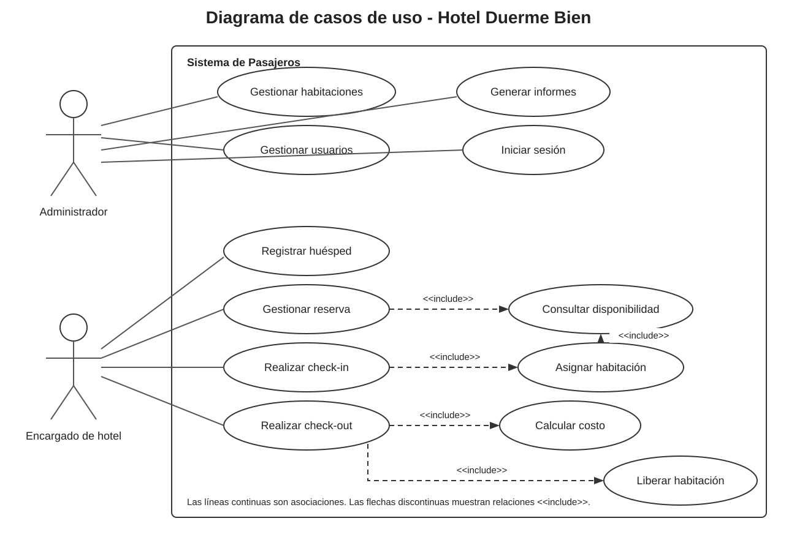

## 2. Ejemplo simple adaptado del material de clases

Se tomó la estructura del ejemplo con Recepcionista, Registrar Check-in, Registrar Check-out y una relación include, y se adaptó al hotel.

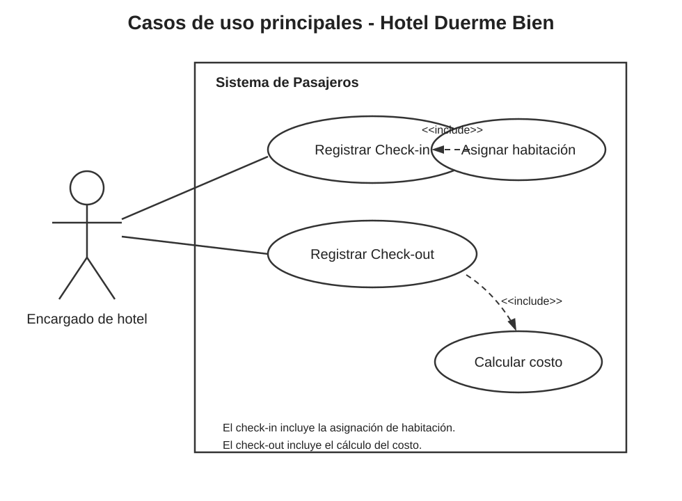

## 3. Ejemplo amplio tipo ATM adaptado al hotel

Este ejemplo permite visualizar la estructura con una operación general, include y extend. Se mantiene como ejemplo complementario de notación UML.

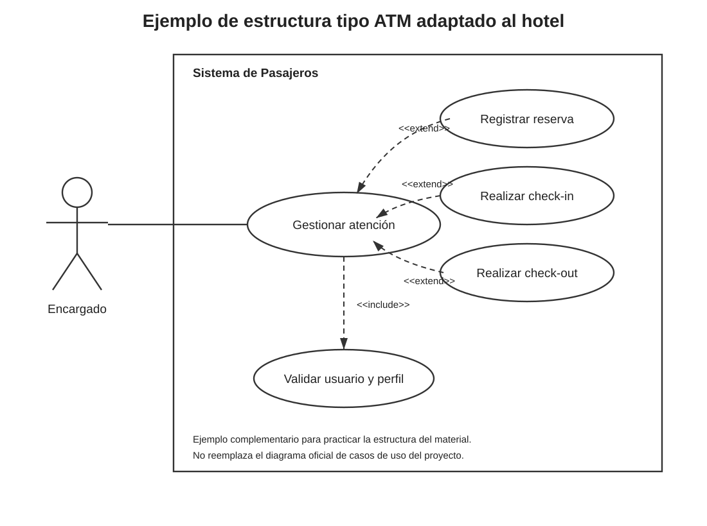

---

# Diagramas de proceso

## Ejemplo basado directamente en el diagrama de procesos entregado

La estructura utilizada es:

Inicio → Captura de datos → Decisión → retorno si existe error → registro en base de datos → fin.

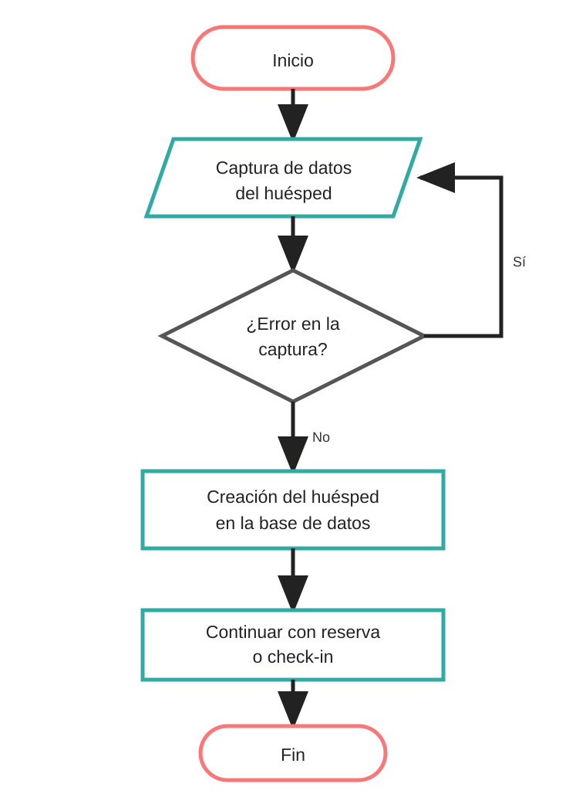

## Proceso de check-in y asignación de habitación

---

# Modelo de base de datos

El modelo separa las entidades principales para evitar repetir información.

### Entidades

- Usuario.
- Habitación.
- Huésped.
- Reserva.
- Reserva_Huésped.
- Estadía.
- Estadía_Huésped.

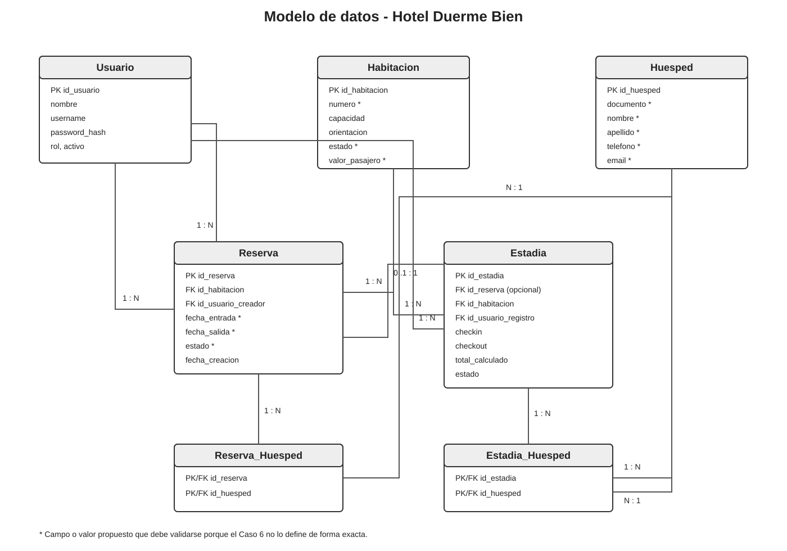

---

# Normalización

La normalización se trabajó siguiendo 1NF, 2NF y 3NF.

### 1NF

Cada campo contiene un valor atómico. Los pasajeros no se guardan como una lista dentro de una celda.

### 2NF

Los atributos dependen de la clave primaria de su tabla.

Ejemplos:

- capacidad y orientación dependen de la habitación;
- nombre y documento dependen del huésped;
- fechas y estado dependen de la reserva;
- check-in, check-out y total dependen de la estadía.

### 3NF

Los datos de cada entidad permanecen separados para evitar duplicación y dependencias innecesarias.

---

# Diagramas de clase

Los diagramas de clase se agregan como material complementario porque los archivos entregados trabajan nombre de clase, atributos, operaciones, relaciones y cardinalidad.

## Diagrama de clases simplificado

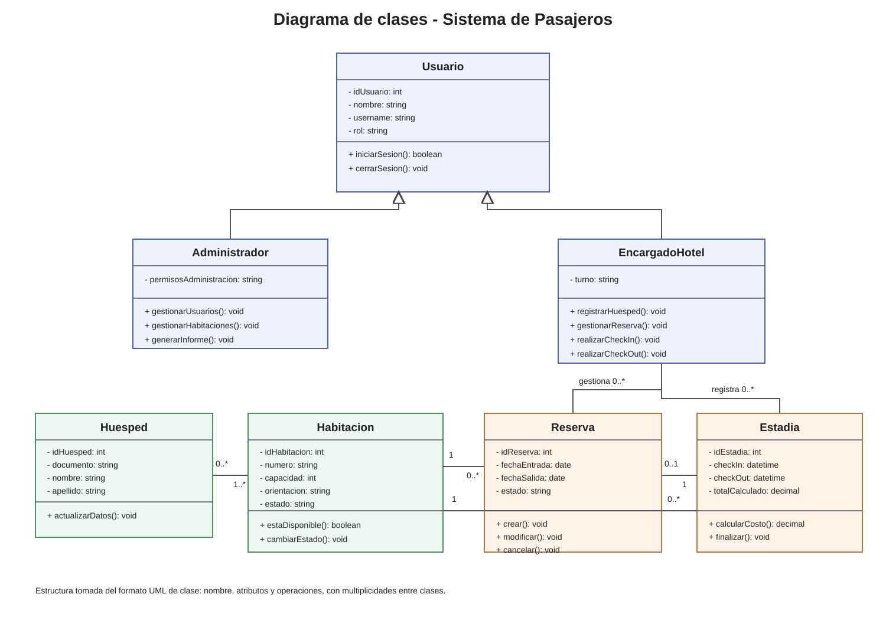

## Diagrama de clases completo

Incluye:

- Usuario.
- Administrador.
- EncargadoHotel.
- Huésped.
- Habitación.
- Reserva.
- Estadía.
- Informe.
- SistemaAutenticacion.
- SistemaEncriptacion.
- ValidacionEntrada.

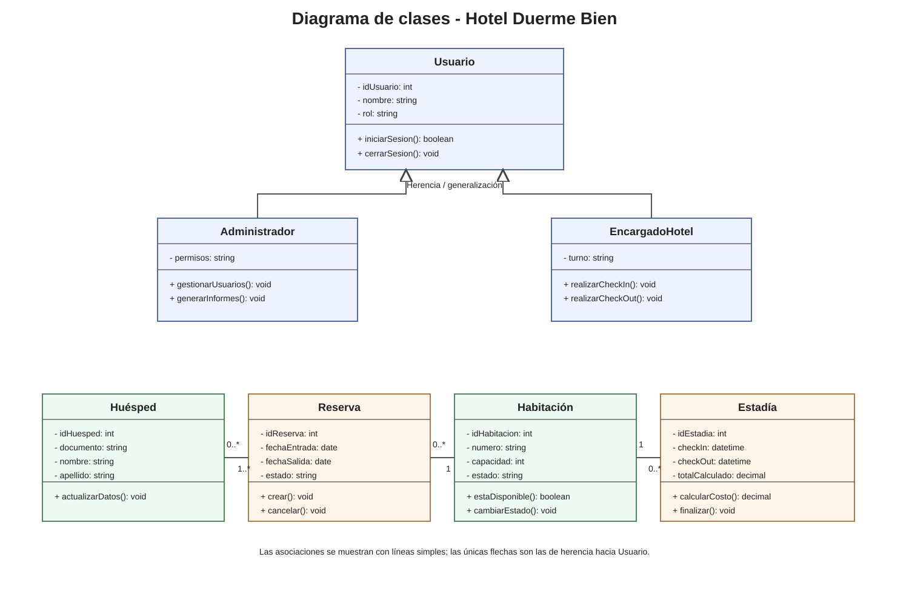

### Relaciones trabajadas

- Asociación.
- Asociación dirigida.
- Multiplicidad.
- Agregación.
- Herencia / generalización.
- Relaciones de apoyo para autenticación, cifrado y validación.

Las relaciones que no se justifican con el Caso 6 no se fuerzan dentro del modelo oficial.

---

# Sketch

Primera distribución de ideas y elementos principales de la interfaz.

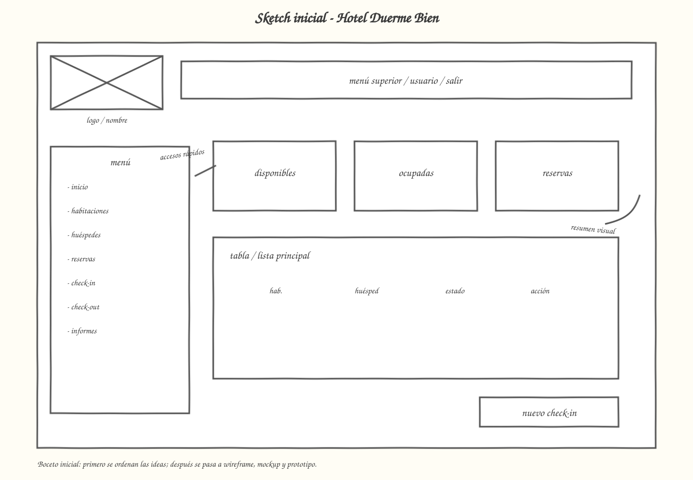

---

# Wireframe

El wireframe muestra estructura y jerarquía sin centrarse en la apariencia visual.

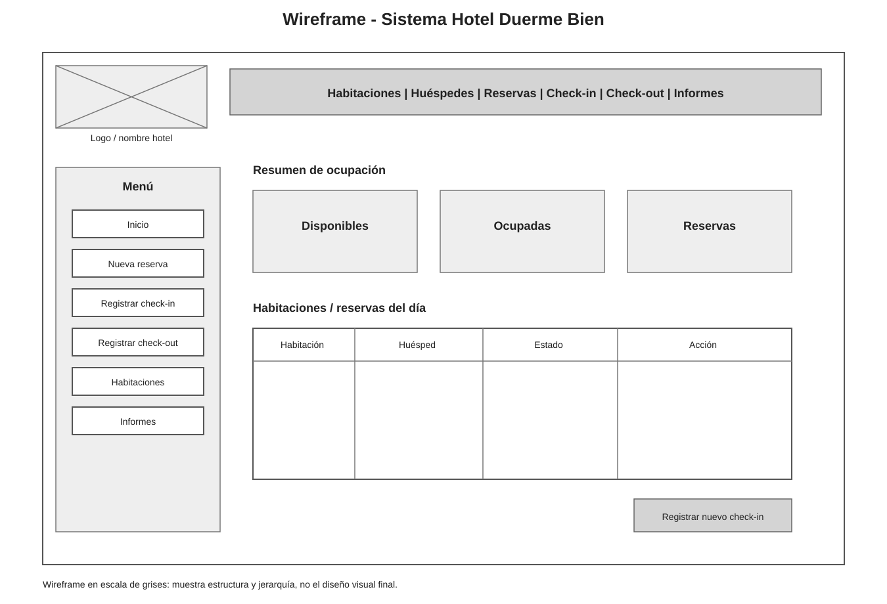

## Wireframe con retícula de 12 columnas

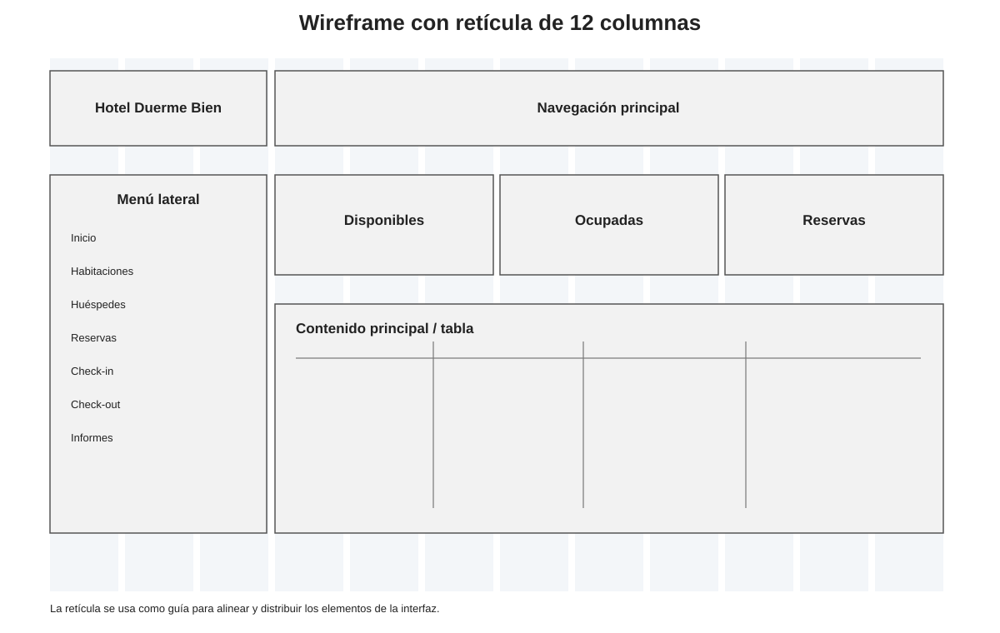

---

# Mockup

El mockup agrega color, tipografía, botones, tarjetas y una apariencia cercana al producto final.

## Versión escritorio

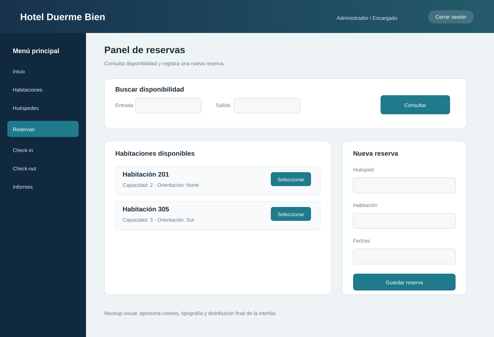

## Versión móvil

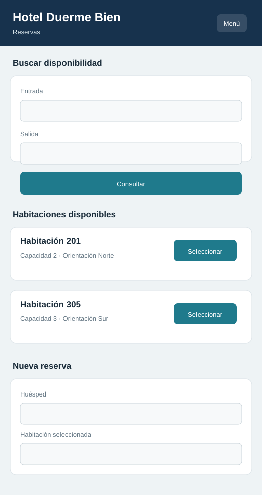

## Pantallas principales

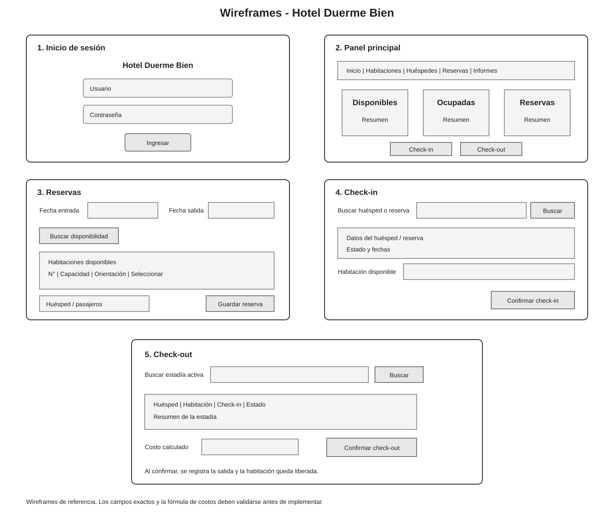

---

# Guía de estilo

Se definió una propuesta visual para mantener consistencia entre las pantallas.

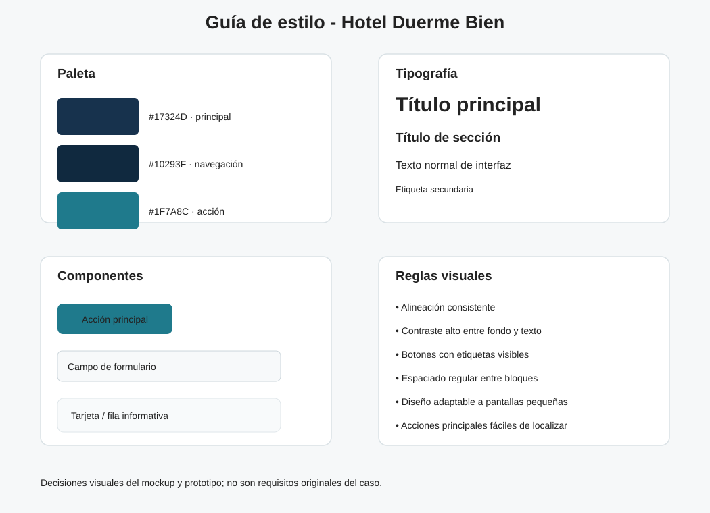

### Paleta utilizada

| Uso | Color |
| --- | --- |
| Barra principal | #17324D |
| Navegación | #10293F |
| Acción principal | #1F7A8C |
| Fondo | #EEF3F5 |
| Tarjetas | #FFFFFF |
| Texto | #1D2A32 |

### Criterios

- Buena alineación.
- Contraste entre texto y fondo.
- Botones claramente identificables.
- Espaciado consistente.
- Diseño adaptable a pantallas pequeñas.
- Menú y acciones principales visibles.

---

# Prototipo

Además de las imágenes estáticas se preparó un prototipo en HTML, CSS y JavaScript.

Permite simular:

- navegación por módulos;
- habitaciones;
- registro de huéspedes;
- reservas;
- check-in;
- check-out;
- informes;
- validaciones simples;
- actualización del estado de habitaciones.

El prototipo está en la carpeta:

~~~text
prototipo/
  index.html
  styles.css
  app.js
~~~

GitHub no ejecuta el prototipo directamente dentro del README, pero toda su parte visual y estructural está mostrada arriba mediante los sketch, wireframes y mockups.

---

# Kanban

| Por hacer | En proceso | Terminado |
| --- | --- | --- |
| Incorporar retroalimentación real de Evaluación 1 | Revisión final de coherencia | Alcance definido |
| Validar fórmula exacta de costos |  | Requerimientos organizados |
| Validar datos obligatorios del huésped |  | Casos de uso |
| Confirmar permisos exactos |  | Diagramas de flujo |
| Confirmar estados de reservas |  | Modelo de datos |
|  |  | Normalización |
|  |  | Sketch |
|  |  | Wireframes |
|  |  | Mockups |
|  |  | Prototipo |
|  |  | Diagrama de clases |
|  |  | Trazabilidad |
|  |  | Documentación Git/GitHub |

---

# Git + GitHub + VS Code

El material de clases también se aplicó al repositorio.

### Git

Se utiliza para:

- rastreo de cambios;
- commits;
- ramas;
- fusión de cambios;
- revertir cambios.

### GitHub

Se utiliza para:

- alojar el repositorio;
- mantener historial;
- trabajar con ramas;
- revisar archivos;
- colaborar.

### Ramas del proyecto

- `main`: rama principal.
- `dev`: rama de desarrollo.

### Clonado

~~~bash
git clone https://github.com/Yutre3/diego.git
cd diego
~~~

### Flujo de trabajo

~~~bash
git status
git add .
git commit -m "Descripción del cambio"
git push
~~~

---

# Pendientes de validar

El Caso 6 no define de forma exacta:

- la fórmula de cálculo de costos;
- los datos personales obligatorios del huésped;
- todos los estados de reserva;
- los permisos específicos de cada perfil;
- la retroalimentación real del docente para la Evaluación 1.

Por eso esos puntos permanecen como pendientes y no se presentan como información oficial.

---

# Archivos del proyecto

Toda la documentación detallada permanece en las carpetas del repositorio, pero los diagramas, ejemplos y elementos principales ya están mostrados directamente en esta página para que no sea necesario abrir cada archivo por separado.
