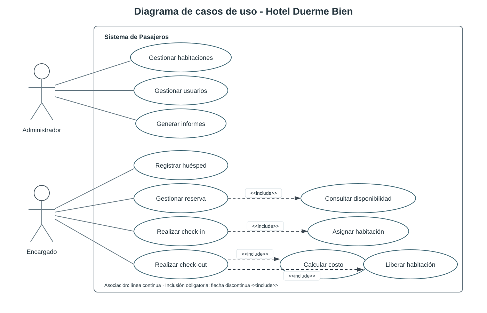
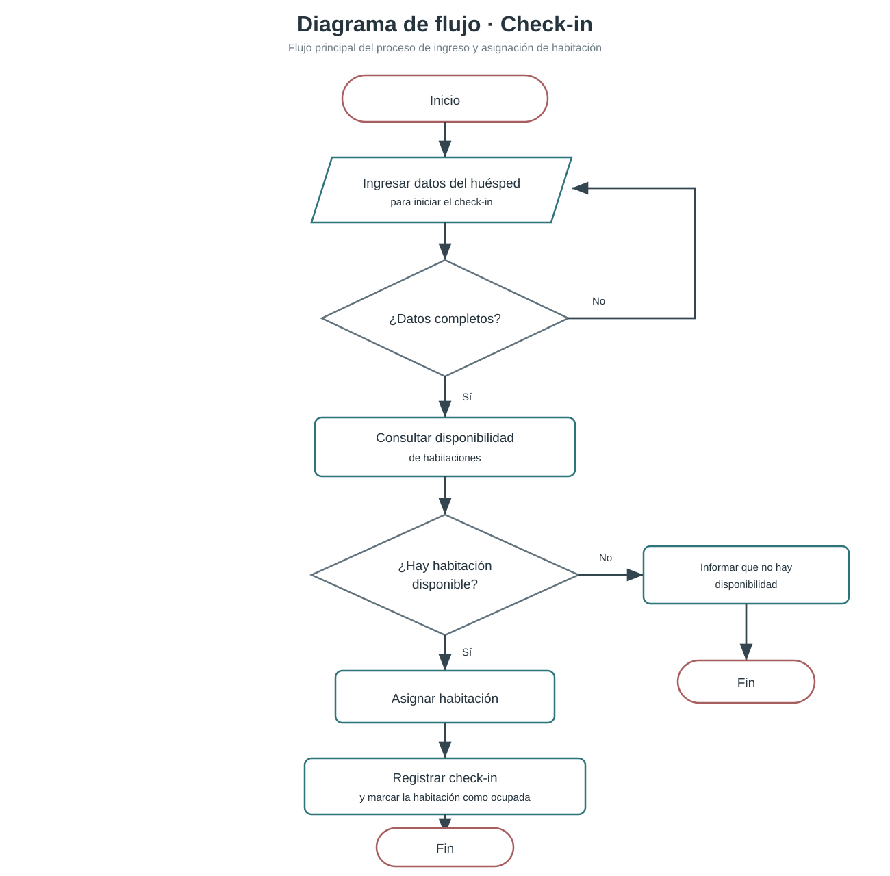
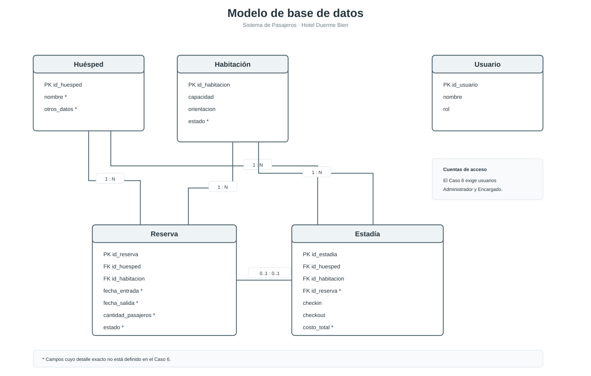
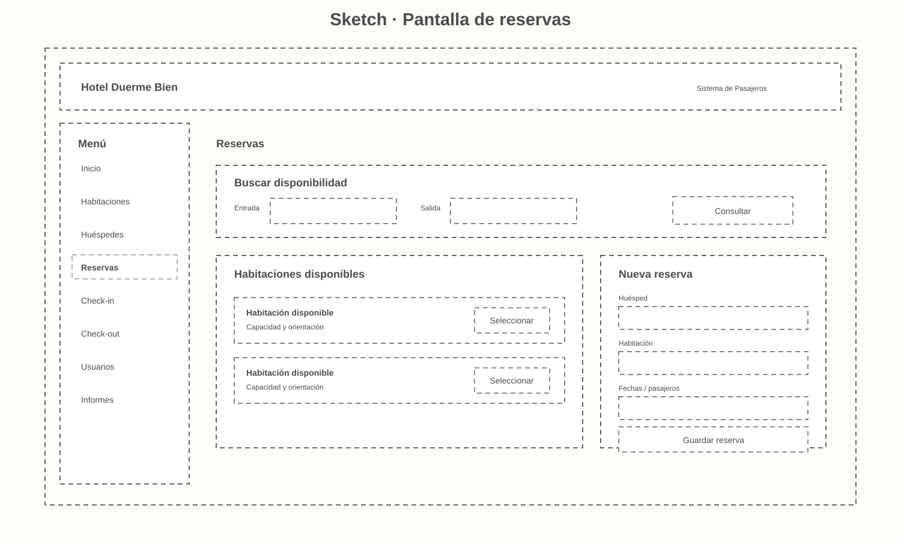
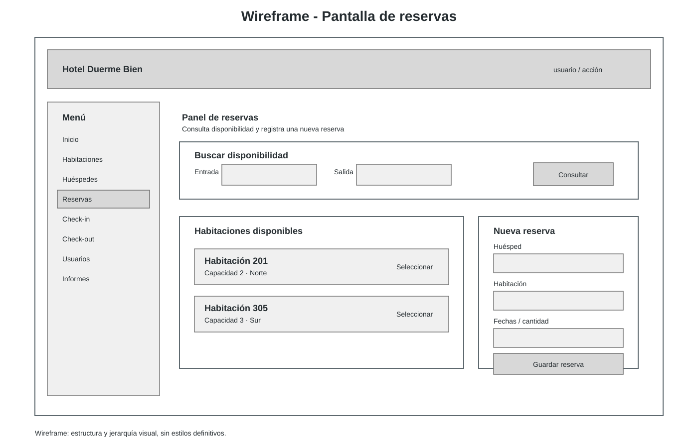
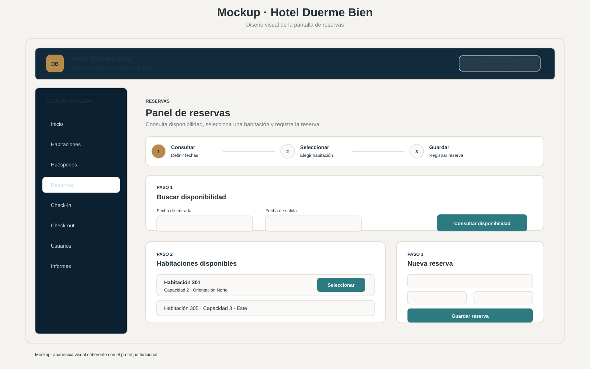

# Sistema de Pasajeros - Hotel Duerme Bien

**Prototipo funcional:** https://yutre3.github.io/diego/prototipo-web/prototipo-funcional.html

## Entrega

### 1. Informe de requerimientos
[Ver informe](entrega-final/01-requerimientos.md)

### 2. Diagrama de casos de uso

[Ver imagen](entrega-final/02-casos-de-uso.svg) · [Editar](https://app.diagrams.net/?mode=github#HYutre3%2Fdiego%2Fmain%2Fdiagramas-editables%2F01-casos-de-uso.drawio)

### 3. Diagrama de flujo

[Ver imagen](entrega-final/03-diagrama-flujo.svg) · [Editar](https://app.diagrams.net/?mode=github#HYutre3%2Fdiego%2Fmain%2Fdiagramas-editables%2F02-diagrama-flujo.drawio)

### 4. Modelo de base de datos

[Ver imagen](entrega-final/04-modelo-base-datos.svg) · [Editar](https://app.diagrams.net/?mode=github#HYutre3%2Fdiego%2Fmain%2Fdiagramas-editables%2F03-modelo-base-datos.drawio)

### 5. Sketch

[Editar interfaz](https://app.diagrams.net/?mode=github#HYutre3%2Fdiego%2Fmain%2Fdiagramas-editables%2F04-interfaz.drawio)

### 6. Wireframe

### 7. Mockup

### 8. Prototipo funcional

[ABRIR PROTOTIPO](https://yutre3.github.io/diego/prototipo-web/prototipo-funcional.html)

### 9. Kanban
[Ver Kanban](entrega-final/09-kanban.md)
