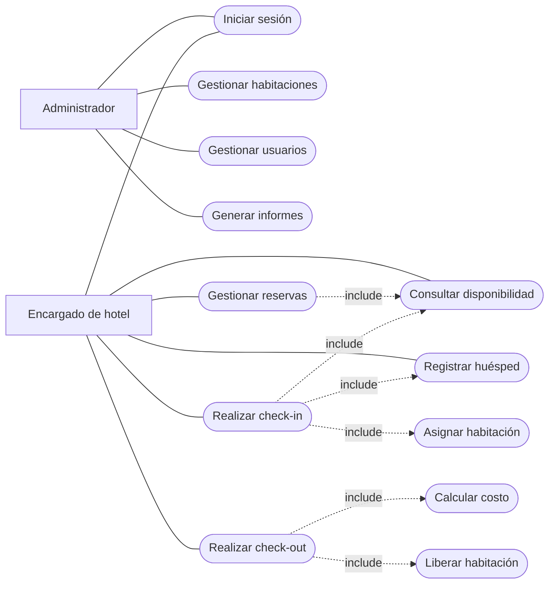
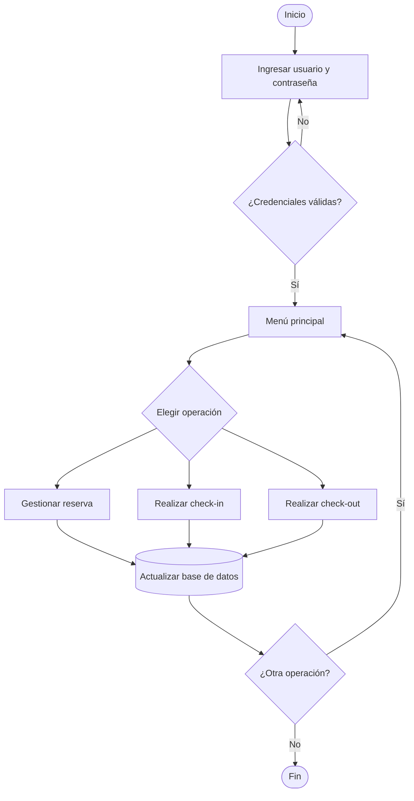
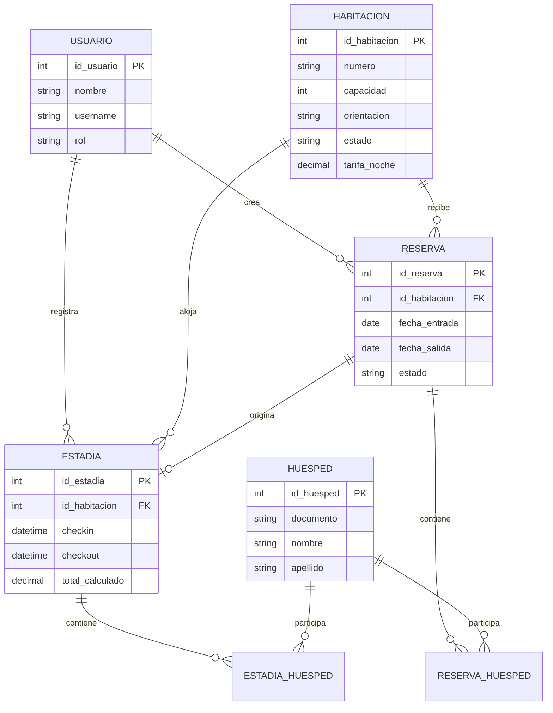

# Modelos visuales para revisar en GitHub

GitHub puede renderizar estos diagramas directamente mediante Mermaid.

## Casos de uso simplificado

## Flujo general

## Modelo de datos simplificado

Estos diagramas son versiones visuales simplificadas para facilitar la revisión y exposición. La documentación detallada permanece en los archivos correspondientes.
