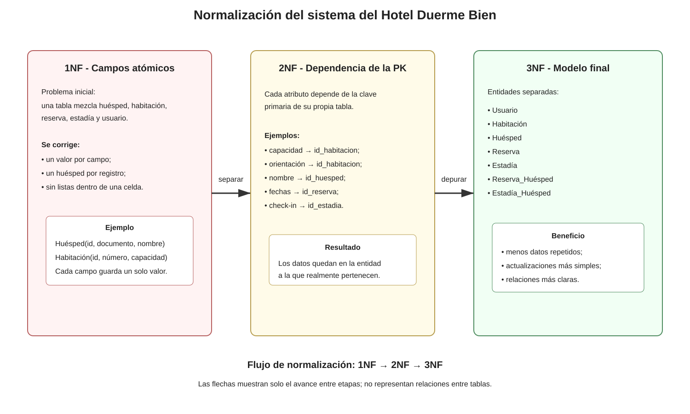
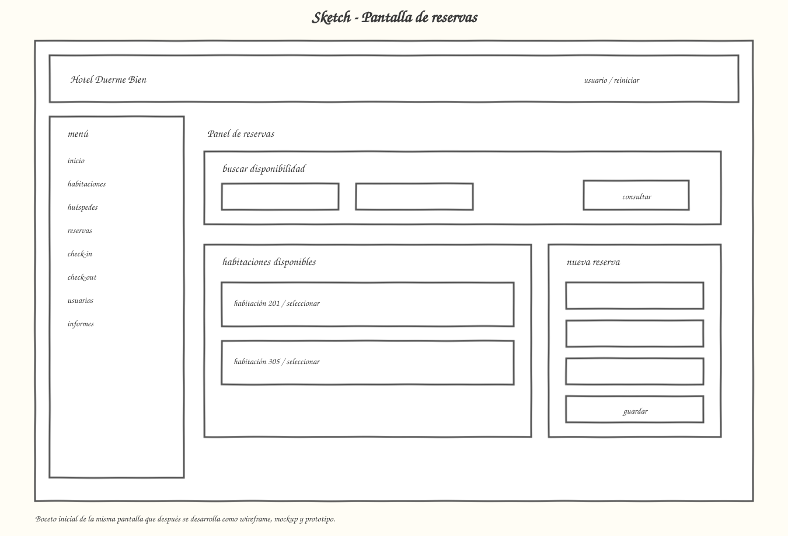
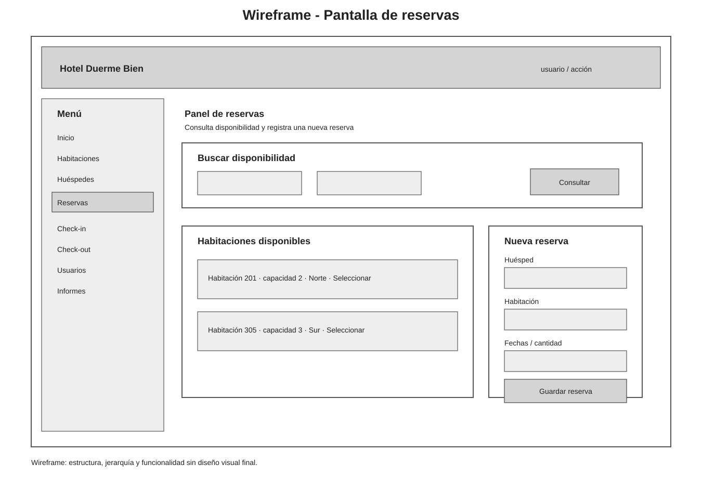

# Entrega final - Hotel Duerme Bien

Esta carpeta reúne una versión principal de cada elemento de la entrega.

## Prototipo funcional basado en el Caso 6

La interfaz funcional se encuentra en [prototipo-web](../prototipo-web/README.md).

Páginas:

- [Acceso](../prototipo-web/login.html)
- [Inicio](../prototipo-web/index.html)
- [Habitaciones](../prototipo-web/habitaciones.html)
- [Huéspedes](../prototipo-web/huespedes.html)
- [Reservas](../prototipo-web/reservas.html)
- [Check-in](../prototipo-web/checkin.html)
- [Check-out](../prototipo-web/checkout.html)
- [Usuarios](../prototipo-web/usuarios.html)
- [Informes](../prototipo-web/informes.html)
- [Material del profesor](../prototipo-web/ayuda.html)

La relación entre los archivos entregados y el contenido del repositorio está documentada en:

[docs/18_trazabilidad_fuentes_profesor.md](../docs/18_trazabilidad_fuentes_profesor.md)

## 1. Requerimientos

[Ver requerimientos completos](01-requerimientos.md)

## 2. Diagrama de casos de uso

## 3. Diagrama de flujo

## 4. Modelo de base de datos

## 5. Normalización

## 6. Diagrama de clases complementario

## 7. Sketch

## 8. Wireframe

## 9. Mockup

## 10. Kanban

[Ver Kanban](11-kanban.md)

## 11. Git + GitHub + VS Code

[Ver guía](12-git-github-vscode.md)
